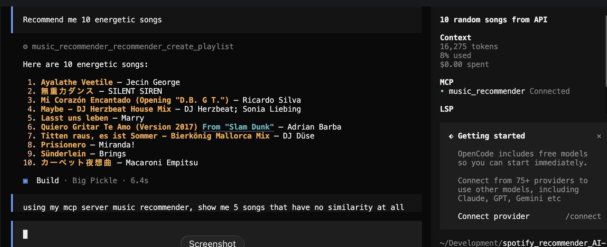

# Spotify Recommender AI Lab

A content-based music recommender: a FastAPI + scikit-learn KNN service, plus an MCP
server so an LLM client (e.g. Claude) can turn a song, artist, genre, or mood into a
generated playlist.

## Validação do PCA

Execute `uv run python analysis/validate_pca.py` para refazer a análise de variância
explicada, reconstrução e preservação dos vizinhos do KNN. O resultado atual está em
[`analysis/PCA_VALIDATION.md`](analysis/PCA_VALIDATION.md). A validação mostrou que duas
componentes servem para visualização, mas não preservam informação suficiente para
substituir o espaço completo padronizado usado pelo recomendador principal.

Two local catalogs back the recommendations:
- `files/dataset(in).csv` — ~90k unique tracks (after de-duping) with full audio-feature
  vectors (danceability, energy, tempo, etc.), used to fit a `NearestNeighbors` model
  over standardized features. Also the only catalog with genre labels, used for
  artist/genre/mood-based recommendations.
- `files/musicas_recomendadas.csv` — ~17k tracks already reduced to a 2D PCA projection,
  used to fit a second `NearestNeighbors` model over those coordinates. Song-seed only.

A search or recommendation request checks both catalogs, so a song is matched and
recommended from whichever source contains it.

## Requirements

- Python 3.11+
- [uv](https://docs.astral.sh/uv/) (recommended) or `pip`

## Setup

```bash
uv sync
```

Or with plain `pip`:

```bash
python -m venv .venv
source .venv/bin/activate
pip install -r requirements.txt
```

No API keys or `.env` file are required — everything runs against the local CSVs in
`files/`, and the MCP server talks to this same API rather than to Spotify directly.

## Run the API

```bash
uv run python main.py
```

This starts the API on `http://0.0.0.0:8000` with autoreload — reachable from other
devices on your LAN (needed for the [mobile app](#mobile-app-opencode-chat-client--catalog-browser)).

Running uvicorn directly is *not* equivalent unless you pass `--host` explicitly:

```bash
uv run uvicorn app.main:app --reload --host 0.0.0.0 --port 8000
```

Without `--host 0.0.0.0`, uvicorn defaults to `127.0.0.1` — the API still works locally
but nothing on your network (including the mobile app) can reach it.

On startup, both KNN models are fit and cached in memory, so the first request isn't
slow but boot takes a few seconds. The MCP server (below) requires this to be running.

## API

- `GET /api/health` — liveness check.
- `GET /api/songs/search?q=<text>&by=song|artist&limit=<n>` — search tracks by song
  name or artist across both catalogs.
- `GET /api/genres` — list every genre available for `by-genre` recommendations.
- `GET /api/moods` — list every mood available for `by-mood` recommendations.
- `GET /api/recommendations?song=<exact track name>&limit=<n>` — nearest neighbors to
  a track, by audio-feature or PCA-coordinate distance.
- `GET /api/recommendations/by-artist?artist=<name>&limit=<n>` — nearest neighbors to
  the centroid of an artist's tracks (main catalog only).
- `GET /api/recommendations/by-genre?genre=<name>&limit=<n>` — nearest neighbors to
  the centroid of a genre's tracks (main catalog only).
- `GET /api/recommendations/by-mood?mood=<name>&limit=<n>` — nearest neighbors to a
  fixed target feature vector for that mood (main catalog only).

All `recommendations*` endpoints return `404` if the seed isn't found/recognized. See
[`specs/mcp_server.md`](specs/mcp_server.md) for the recommendation math and the mood
taxonomy.

Interactive docs are available at `http://localhost:8000/docs` while the server is
running.

## MCP server

`mcp_server/` is a separate process — a thin stdio MCP server that calls the API above
over HTTP (it does not import anything from `app/`). It generates track lists; it does
**not** create or modify a real Spotify playlist, so no Spotify login is involved.

Tools exposed:
- `recommender_search_song` — search by song title or artist name.
- `recommender_list_genres` / `recommender_list_moods` — discover valid seed values.
- `recommender_create_playlist` — build a playlist from `seed_type` (`song` / `artist`
  / `genre` / `mood`) + `seed` + `size`.

The server speaks stdio MCP, so it's meant to be launched *by* a client, not run and
left sitting in a terminal on its own. Make sure the API is running first
(`uv run python main.py`), then open it one of these ways:

### Claude Code

This repo includes a project-level [`.mcp.json`](.mcp.json), so opening the repo in
Claude Code registers the `music_recommender` server — but Claude Code only reads
`.mcp.json` at session start, so **restart the session** (exit and run `claude` again)
after this file is added or changed; `/mcp` itself won't reload it. The first time,
Claude Code also asks you to approve a new project-scoped server — accept the prompt
(if you'd previously dismissed it, run `claude mcp reset-project-choices` to get asked
again). Then `/mcp` should list `music_recommender` with its 4 tools, and you can just
ask for a playlist in normal chat (e.g. "make me a playlist for when I'm feeling
calm").

### Claude Desktop

Add this to your `claude_desktop_config.json`, then fully restart Claude Desktop:

```json
{
  "mcpServers": {
    "music_recommender": {
      "command": "uv",
      "args": ["run", "--directory", "/absolute/path/to/spotify_recommender_AI-lab", "python", "-m", "mcp_server.server"]
    }
  }
}
```

The tools then appear under the 🔌/tools icon in the chat box.

### OpenCode

OpenCode does **not** read `.mcp.json` (that's Claude's format) — it uses its own
[`opencode.json`](opencode.json) at the project root, already included:

```json
{
  "$schema": "https://opencode.ai/config.json",
  "mcp": {
    "music_recommender": {
      "type": "local",
      "command": ["uv", "run", "python", "-m", "mcp_server.server"],
      "enabled": true,
      "environment": {
        "MUSIC_API_BASE_URL": "http://localhost:8000/api"
      }
    }
  }
}
```

As with Claude Code, OpenCode reads this file at startup, so restart OpenCode after it
changes for the server to show up. The command is intentionally path-independent so
the same config works on Windows, macOS, and Linux: `uv` must be available on `PATH`,
and `opencode serve` must be started from the repository root.

### MCP Inspector (no LLM client needed)

To browse and call the tools by hand — useful for testing without going through an
LLM:

```bash
npx @modelcontextprotocol/inspector uv run python -m mcp_server.server
```

This opens a local web UI where you can pick a tool (e.g. `recommender_create_playlist`),
fill in its arguments in a form, and see the raw JSON response.

---

The API base URL defaults to `http://localhost:8000/api`; override it with the
`MUSIC_API_BASE_URL` environment variable (set in `.mcp.json` or your client config)
if the API runs elsewhere.

## Mobile app (OpenCode chat client + catalog browser)

`mobile/` is a separate Expo/React Native app with two ways to get recommendations:
a chat interface for talking to [OpenCode](https://opencode.ai) (backed by OpenRouter
models), and a **Browse Catalog** screen (the 🔍 icon on the chat header) that calls
the FastAPI API above directly — search by song, artist, or mood and get back a
track list with album art, no LLM round-trip needed. Album art is fetched client-side
from Spotify's public oEmbed endpoint, keyed off the real Spotify track IDs already
embedded in every `spotify_url` — no Spotify credentials involved. The same track-list
rendering is used in chat, too: a `recommender_create_playlist` tool result now shows
as a real list with cover art instead of raw JSON.

Since it talks to two separate local servers, both need to be reachable from your
phone:

1. **Start the OpenCode server**, from the repo root so `opencode.json`'s MCP
   registration is picked up:
   ```bash
   export OPENROUTER_API_KEY=sk-or-v1-...        # or: opencode auth login
   export OPENCODE_SERVER_PASSWORD=some-password  # optional, recommended once you leave localhost
   opencode serve --hostname 0.0.0.0 --port 4096
   ```
2. **Start the API** (needed for both `music_recommender` tool calls in chat and the
   Browse Catalog screen):
   ```bash
   uv run python main.py
   ```
3. **Find your computer's LAN IP** (macOS: `ipconfig getifaddr en0`) and verify both
   servers are reachable: `curl http://<lan-ip>:4096/global/health` and
   `curl http://<lan-ip>:8000/api/health`.
4. **Install and start the mobile app**:
   ```bash
   cd mobile
   npm install
   npx expo start
   ```
5. **Open it on your phone** with [Expo Go](https://expo.dev/go) (scan the QR code).
   If Metro isn't reachable from your phone, use `npx expo start --tunnel` instead.
6. **Connect the app**: tap the gear icon → enter the OpenCode server URL from step 3
   (or a Tailscale/Cloudflare Tunnel URL) → username (`opencode` by default) → password
   from step 1 → **Test Connection** → **Save**. The Recommender API URL below it
   defaults to the same host on port 8000 — override it only if the FastAPI app runs
   somewhere else — then **Test Connection** → **Save** there too.
7. Start chatting, or tap 🔍 to browse the catalog directly. Use the model button in
   the chat header to pick a specific OpenRouter model, or leave it on the default.

Full details and troubleshooting live in [`mobile/README.md`](mobile/README.md).

## Project layout

```
app/
  main.py                   FastAPI app + startup lifespan (warms the KNN models)
  api/routes.py             Route handlers
  core/config.py            Settings (CORS origin, .env support)
  data/loader.py            CSV loading and cleaning
  services/recommender.py   KNN catalogs, search and recommendation logic
  models.py                 Pydantic request/response schemas
mcp_server/
  server.py                 MCP tool definitions (music_recommender_mcp)
  client.py                 Shared HTTP client + error formatting for the API above
files/                      Source datasets
specs/                      Design specs (see specs/mcp_server.md for the MCP server)
mobile/                     Expo/React Native chat client for OpenCode (see mobile/README.md)
.mcp.json                   Claude Code project MCP config
```

## Not built (by design)

See [`specs/mcp_server.md`](specs/mcp_server.md) for the full list — notably: no real
Spotify OAuth or playlist writes, no moods beyond the fixed 7, no HTTP transport or
auth on the MCP server.

