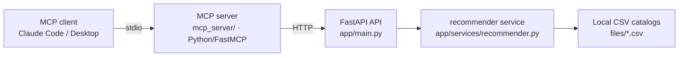

# MCP Server for Playlist Generation (Part 2 spec)

Status: **implemented.** This document is kept as the design record: architecture,
endpoint contracts, the mood taxonomy, and the reasoning behind them. See
[`README.md`](../README.md) for run instructions.

## 1. Goal

Let an LLM client (e.g. Claude, via MCP) build a playlist from one of four seed types:

- an **artist name**
- a **song name**, if it exists in our dataset
- a **genre**
- an **emotion/mood** the user is currently feeling

The output is a **generated track list** (name, artist, Spotify link) produced by our
own KNN recommender — not a real playlist written to a user's Spotify account. No
Spotify OAuth, no `spotipy`, no login flow: this keeps the "no external credentials
required" property established in Part 1.

## 2. Architecture

The MCP server is a **thin HTTP client** of the existing API — it calls
`http://localhost:8000/api` by default (configurable via the `MUSIC_API_BASE_URL` env
var) and does not import anything from `app/` directly. The two processes stay
independently runnable and testable: the API works standalone (as today, via
`curl`/`/docs`), and the MCP server can be pointed at any running instance of it.

**Language**: Python + FastMCP, for consistency with the existing all-Python stack in
`app/`, rather than the generally-recommended TypeScript for new MCP servers. This is a
deliberate, revisitable call made for this project.

**Transport**: stdio by default, for local use with Claude Code/Desktop. Streamable
HTTP is a possible future option if remote/multi-client access is ever needed — not
built now.

## 3. New API endpoints needed

All new endpoints live alongside the existing ones in `app/api/routes.py`, backed by
new functions in `app/services/recommender.py`. They reuse the existing
`RecommendedTrackOut` response model (`app/models.py`) — no new response schema.

| Method | Path | Params | Returns | Notes |
|---|---|---|---|---|
| GET | `/api/recommendations` | `song`, `limit` | `list[RecommendedTrackOut]` | **Existing**, reused as-is for the song seed |
| GET | `/api/recommendations/by-artist` | `artist`, `limit` | `list[RecommendedTrackOut]` | New |
| GET | `/api/recommendations/by-genre` | `genre`, `limit` | `list[RecommendedTrackOut]` | New |
| GET | `/api/recommendations/by-mood` | `mood`, `limit` | `list[RecommendedTrackOut]` | New |
| GET | `/api/genres` | — | `{"genres": [str]}` | New — distinct `track_genre` values in the main catalog |
| GET | `/api/moods` | — | `{"moods": [str]}` | New — the 7 fixed mood labels (§5) |

All `by-*` endpoints return `404` with an actionable message if the seed isn't found or
recognized (e.g. unknown genre → "genre not found, see GET /api/genres for valid
values").

## 4. Unified recommendation math

Rather than four different algorithms, every seed resolves to one **query vector** in
the same standardized 14-feature space already used by `/api/recommendations`
(`app/services/recommender.py`'s main catalog), and a single shared `kneighbors` call
serves all four cases:

| Seed | Query vector |
|---|---|
| song | that track's own scaled feature vector (existing behavior) |
| artist | centroid of that artist's tracks' scaled feature vectors |
| genre | centroid of that genre's tracks' scaled feature vectors |
| mood | a synthetic vector — see below |

**Mood vector construction**: take the dataset's column means for the 8 non-emotion
features (`popularity`, `duration_ms`, `key`, `mode`, `speechiness`,
`instrumentalness`, `liveness`, `time_signature`), plug in the mood's target raw values
for the 6 emotion-relevant features (`valence`, `energy`, `danceability`,
`acousticness`, `tempo`, `loudness`), then transform the resulting row through the
**same fitted `StandardScaler`** used to build the main catalog.

This requires one implementation change: today `_build_main_catalog()` fits a
`StandardScaler` and only keeps the transformed matrix, discarding the scaler. The
scaler instance needs to be kept on `_Catalog` (or similar) so mood/artist/genre
vectors can be transformed consistently with the fitted training distribution.

Only the query-vector construction and the "exclude from results" set differ per seed
type — self track for song, the artist's own tracks for artist, nothing extra for
genre/mood.

**Known limitation, by design**: the secondary catalog (`files/musicas_recomendadas.csv`,
2D PCA coordinates only, no genre/artist/raw features) stays **song-seed-only**, exactly
as in Part 1. Artist/genre/mood seeds only search the main catalog
(`files/dataset(in).csv`).

## 5. Mood taxonomy

A fixed starter set of 7 moods, each mapped to raw target values on Spotify's native
audio-feature scales. This is a heuristic starting point (a standard valence/arousal
style mapping), meant to be tuned later against real listening feedback, not a model
fit to data.

| mood | valence | energy | danceability | acousticness | tempo (BPM) | loudness (dB) |
|---|---|---|---|---|---|---|
| happy | 0.80 | 0.70 | 0.70 | 0.20 | 120 | -6 |
| sad | 0.15 | 0.25 | 0.35 | 0.60 | 75 | -12 |
| energetic | 0.60 | 0.90 | 0.70 | 0.10 | 135 | -4 |
| calm | 0.50 | 0.20 | 0.40 | 0.70 | 80 | -14 |
| romantic | 0.55 | 0.35 | 0.45 | 0.50 | 90 | -9 |
| angry | 0.20 | 0.85 | 0.50 | 0.05 | 140 | -4 |
| focused | 0.40 | 0.35 | 0.40 | 0.60 | 100 | -11 |

## 6. MCP server design

- **Server name**: `music_recommender_mcp` (follows the `{service}_mcp` naming
  convention).
- **Location**: new `mcp_server/` package at the repo root (`server.py`, `client.py`),
  sharing the root `pyproject.toml`/venv rather than a separate sub-project.
- **Tools** (4 total — kept focused and atomic per MCP best practices):

  1. `recommender_search_song(query, by="song"|"artist", limit)` — wraps
     `GET /api/songs/search`. `readOnlyHint=true`, `idempotentHint=true`.
  2. `recommender_list_genres()` — wraps `GET /api/genres`. `readOnlyHint=true`,
     `idempotentHint=true`.
  3. `recommender_list_moods()` — wraps `GET /api/moods`. `readOnlyHint=true`,
     `idempotentHint=true`.
  4. `recommender_create_playlist(seed_type: "song"|"artist"|"genre"|"mood", seed,
     size=15)` — dispatches to the matching `/api/recommendations...` endpoint and
     returns a playlist title (e.g. `"Playlist inspired by {seed}"`) plus the track
     list. `readOnlyHint=true`, `destructiveHint=false`, `idempotentHint=true`
     (deterministic KNN — same seed always yields the same playlist),
     `openWorldHint=true` (talks to the API over the network).

  Each tool takes a Pydantic input model with `Field(..., description=...)`
  constraints, and has a docstring documenting args, return JSON schema, and example
  usages, per the mcp-builder Python guide.

- **Error handling**: a shared `_handle_api_error` helper (in `client.py`) translates
  HTTP errors into actionable tool responses, e.g. a 404 on `by-genre` becomes
  `"Error: genre not found. Call recommender_list_genres to see valid values."`

## 7. Explicitly out of scope (for now)

- Real Spotify OAuth or playlist-modify writes to a user's actual account.
- Moods beyond the fixed 7.
- Streamable HTTP transport for the MCP server.
- Any authentication/authorization on the MCP server itself (local stdio only).

## 8. Build order (completed)

1. ✅ Added the new API routes + service functions (`/api/genres`, `/api/moods`,
   `/api/recommendations/by-artist`, `by-genre`, `by-mood`); the fitted
   `StandardScaler` is now kept on `_Catalog` for vector construction.
2. ✅ Verified each new endpoint with `curl`.
3. ✅ Scaffolded `mcp_server/` (`server.py`, `client.py`); added `mcp[cli]`/`httpx` to
   `pyproject.toml`. Note: the installed SDK is v2, where `FastMCP` was renamed to
   `MCPServer` (`from mcp.server.mcpserver import MCPServer`) — the tool/annotation
   API is otherwise the same shape the mcp-builder guide documents for v1.
4. ✅ Implemented the 4 tools against the endpoints above.
5. ✅ Smoke-tested end-to-end with a real `ClientSession` over `stdio_client` spawning
   `python -m mcp_server.server` against a live API instance (no Node/Inspector
   needed) — all 4 tools verified, including the 404 → actionable-error paths.
6. ✅ Added real "how to run the MCP server" instructions to `README.md`, plus a
   project-level `.mcp.json` so Claude Code auto-registers the server.
